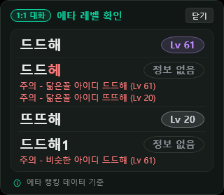
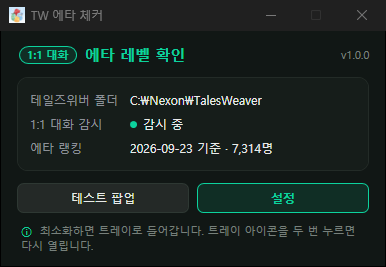
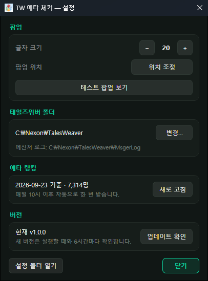

# TWEtaChecker

테일즈위버 1:1 대화 상대의 에타 레벨을 팝업으로 알려 주는 프로그램입니다.\
TWChatOverlay의 1:1 대화 에타 기능만 분리했습니다.\
게임 메모리는 건드리지 않고, 게임이 남기는 메신저 로그(`MsgerLog\*.html`)만 읽습니다.

## 기능

* 상대 아이디 옆에 에타 레벨(`Lv 84`)을 표시합니다.
* 랭킹에 없으면 `정보 없음`으로 나옵니다.
* 랭킹에 없는 아이디에는 빨간 글씨로 주의 표시를 붙입니다.
  * 특수 문자가 들어 있는 아이디
  * `길드`, `클랜`처럼 의심스러운 문구가 들어 있는 아이디
  * 랭킹에 닮은 아이디가 있는 경우 (예: `드드해` ↔ `뜨뜨해`)

 

## 사용법

1. [최신 버전](https://github.com/TWHome-Git/TWEtaChecker/releases/latest)에서 `TWEtaChecker.exe`를 받아 실행합니다.
2. 처음 실행할 때 테일즈위버 설치 폴더(보통 `C:\Nexon\TalesWeaver`)를 고릅니다.
3. 상태 창의 설정에서 폰트 및 위치, 테일즈위버 경로 설정을 바꿀 수 있습니다.
4. 최소화하면 트레이로 들어가고, 트레이 아이콘을 두 번 누르면 다시 열립니다.
5. 새 버전이 나오면 상태 창에 알림이 뜨고, 업데이트를 누르면 바로 바뀝니다.

| 상태 창 | 설정 |
|:---:|:---:|
|  |  |
